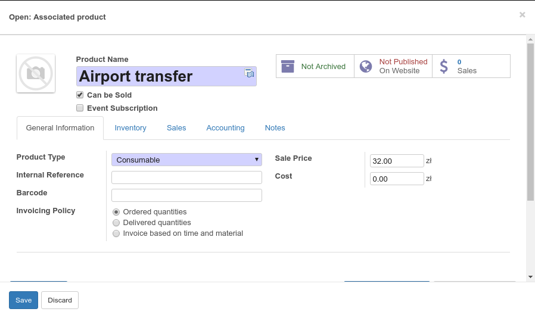
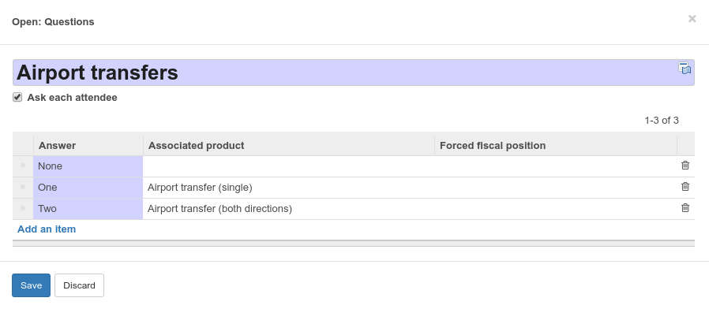

# Event question prices

This addon allows to create a bit more involved pricing structure for event
module tickets: instead of just pricing them on the event page, you can assign
products to question answers. When a participant selects this answer on
registration page, the product is automatically added to the cart.

Let's start with an example: you organize a conference with a typical pricing structure
(Early bird, normal, late...) but you would also like to offer optional services:

 * airport transfer,
 * addidional meals before and after the conference, etc.

that can be combined with all other ticket types.

If you try to encode all that in simple event tickets, you get a cartesian product of all combinations totally incoprehensible to your potential attendees. This addon was created to solve just that.

First thing to do after installation is to create products you want to assign to you answers:

Then, create question and answers on the event configuration page and optionally assign products to some answers:

That's it! 
